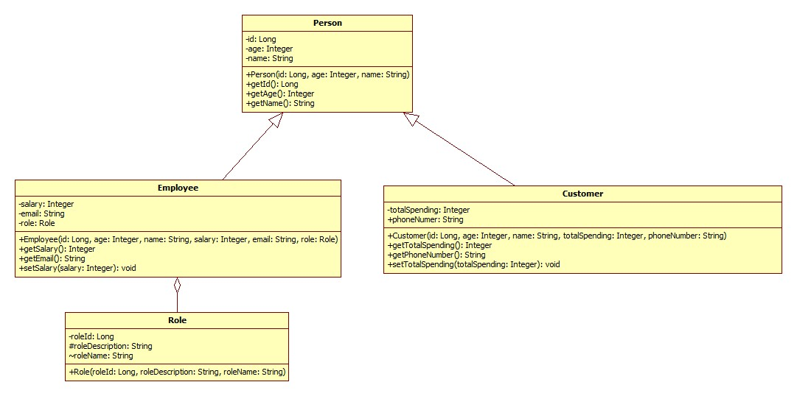

🔴 IMPORTANT - READ CAREFULLY! 🔴

> ⚠️ This is an important assignment that must be completed in full.
> 
> 📋 **ALLOWED RESOURCES:**
> - **Your laptop only**
> - **GitHub Copilot - inline chat mode only**
>   - ❌ No full chat conversations and no separate windows
>   - ❌ No external resources, documents, or AI chat tools
---

> ℹ️ If additional elements are needed (e.g., getters/setters), you are allowed to add them.

# Starting from the provided template, implement a program that follows the specifications below:

- Create the classes described in the diagram, including their elements, and represent the relationships between them. (3p)

- Extend the program to prevent duplicate employees based on employee email. (1p)

- Create a method that adds employees. Use the predefined `Set` from `EmployeeManager` to store and manage employees.
  Call it from the main method and add three employees. (1p)

- Create a method to display all employee names with their salaries. (1p)

- Implement `updateSalaryById(Long id, Integer salary)` that updates an employee's salary by ID. (1p)

- Implement `findByEmail(String email)` in `EmployeeManager` so it returns the employee with the given email.
  The search must be case-insensitive and ignore leading/trailing spaces. (1p)

- Write unit tests to verify that employees with a given email are correctly found by the `findByEmail` method. (1p)

[//]: # (  #####################################)

[//]: # (- Create the classes described in the diagram, including their elements, and represent the relationships between them. &#40;3p&#41;)

[//]: # ()
[//]: # (- Extend the program to prevent duplicate customers based on customer email. &#40;1p&#41;)

[//]: # ()
[//]: # (- Create a method that adds customers. Use the predefined Set from CustomerManager to store and manage customers.)

[//]: # (  Call it from the main method and add three customers. &#40;1p&#41;)

[//]: # ()
[//]: # (- Create a method to display all customer names sorted alphabetically with their total spending. &#40;1p&#41;)

[//]: # ()
[//]: # (- Implement a method findByEmail&#40;String email&#41; in CustomerManager that returns the customer with the given email.)

[//]: # (  The search must be case-insensitive and ignore leading/trailing spaces. &#40;1p&#41;)

[//]: # ()
[//]: # (- Implement updateSpendingByEmail&#40;Long id, int amount&#41; so it increases the customer's)

[//]: # (  total spending identified by ID. &#40;1p&#41;)

[//]: # ()
[//]: # (- Write unit tests to verify:)

[//]: # (  Customers with a given email are correctly found by the findByEmail method. &#40;1p&#41;)
