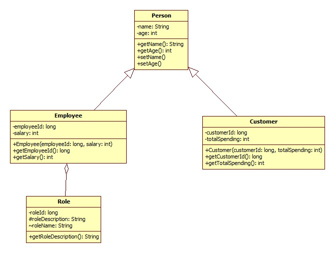

# Starting from the template, implement the following exercises:

1) Implement a program according to specifications bellow:
 ## Exercise 1
   
##
- Create the classes described in the diagram. (1p)

- Represent the elements inside the classes correctly. (1p)

- Create relationships between the classes. (2p)

- Create a Set of students,add five students and assign a grade to each student. (1p)

- Create a method that computes the arithmetic mean for all students. (1p)

- Create a method that returns the student with the highest grade. (1p)

- Create a test for each method and check if the arithmetic mean is computed correctly and the student with the highest grade is found (1p)

- Extend the program to not allow the same student to be added twice (check over studentId). (1p)

